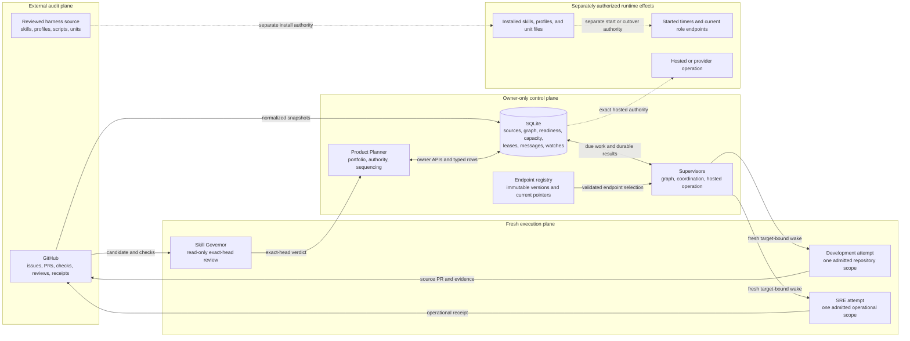
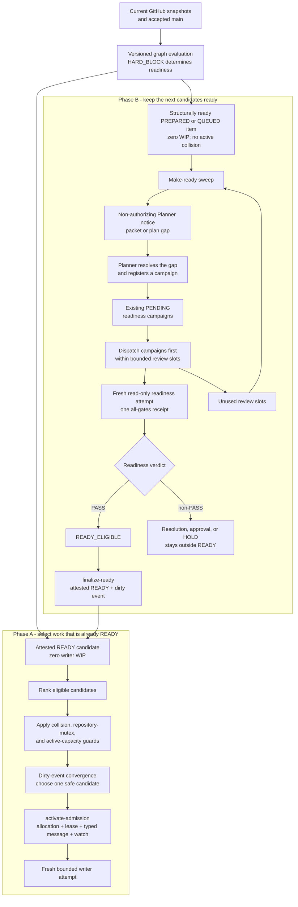
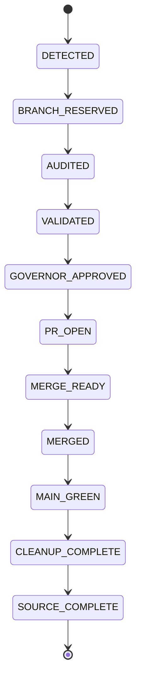

# Harness architecture

Twinfinity's harness separates durable coordination, fresh execution, and
external audit. The Product Planner owns portfolio control. Development and
SRE executors are fresh, target-bound attempts. GitHub records collaborative
facts and receipts, while an owner-only SQLite database holds local queue and
state-machine truth.

> **Source/runtime boundary:** this guide describes the reviewed contracts in
> this repository. "Current" below means implemented in source. It does not
> prove that these bytes are installed, that a registry pointer has moved, that
> a timer is running, or that a provider operation is authorized.

## Planes and ownership



Solid arrows are ordinary data and control relationships. Dashed arrows cross
an authority boundary: source validation does not authorize installation,
installation does not activate a profile or timer, and a queued operation does
not authorize a hosted effect.

- **GitHub** is the external source and audit surface, not a local lock,
  heartbeat, queue, or lease service.
- **SQLite** is the same-host coordination truth. Transactions bind source
  digests, graph revisions, policies, candidates, allocations, leases,
  attempts, watches, and receipts.
- **The Product Planner** is the sole durable scheduler and delivery
  controller. It does not author or approve its own source candidate.
- **Development and SRE** consume one exact typed admission or watch. An
  endpoint pointer routes a fresh attempt; it grants no authority by itself.
- **The Skill Governor** independently evaluates one exact source head. Its
  verdict is evidence, not mutation or merge authority.

## Two-phase Kanban scheduling

The scheduler is dependency-aware and ranked, not pure FIFO. Only `HARD_BLOCK`
relations affect topological readiness. `ORDER_AFTER` is a ranking preference,
while `COLLISION` prevents overlapping mutable work from being selected
together. Among eligible nodes, priority, lane order, readiness time,
critical-path value, unlock value, and stable tie-breakers establish the order.
Capacity remains a safety ceiling, never a utilization target.



Phase A considers only candidates already finalized as `READY`.
`activate-admission` is the first step that creates writer allocation, a lease,
a typed message, and a terminal watch. Phase B first dispatches existing
`PENDING` readiness campaigns, then uses unused review slots to find
structurally ready, source-current, zero-WIP work with a packet or plan gap.
The sweeper enqueues a non-authorizing Planner notice; it does not build a
packet, create `READY`, acquire capacity, or bypass a dependency or collision.

Readiness review slots are not Development, Shared, or SRE writer capacity.
Prepared and finalized `READY` candidates remain zero-WIP. Phase A commits
before Phase B, so a Phase B failure cannot rewrite the Phase A decision.

### State namespaces

| Namespace | Normal states | Meaning |
| --- | --- | --- |
| Graph projection | `structurally_ready`, `executable_ready` | Dependencies permit preparation; executable readiness also requires an item in `READY`. |
| Pull-buffer candidate | `PREPARED_NOT_READY` -> `READY` | A reviewed packet becomes dispatchable only through readiness finalization. |
| Readiness campaign | `PENDING` -> `RUNNING` -> `READY_ELIGIBLE` -> `FINALIZED` | `READY_ELIGIBLE` is a review result; `FINALIZED` attests the separate candidate/item transition. |
| Coordination item/allocation | `PREPARED/NONE` -> `READY/NONE` -> `ACTIVE/ACTIVE` -> `PUBLICATION_PENDING/ACTIVE` -> `DONE/NONE` | Allocation and lease start at admission and remain held through receipt publication. |
| Typed inbox message | `PREPARED` -> `CLAIMED` -> `COMPLETE` | Completion records local message consumption, not delivery completion. |
| Executor attempt | `RESERVED` -> `LAUNCHING` -> `RUNNING` -> `COMPLETE` | Attempt completion does not complete the item or terminal watch. |

`HOLD`, `STALE`, bounded resolution, and narrow recovery variants fail closed
outside this normal path. They provide no generic shortcut back to work.

## Harness source-delivery state machine

Harness maintenance uses a coarse source lifecycle, separate from the SQLite
item, message, readiness, and executor-attempt states above.



- `BRANCH_RESERVED` binds one starting-main SHA, `change/*` branch, sibling
  worktree, exact path lease, and Shared writer allocation.
- `VALIDATED` binds proportional deterministic evidence to the exact head;
  `GOVERNOR_APPROVED` requires an independent `APPROVE_SOURCE_HEAD` receipt for
  that same head. The writer cannot self-review or merge.
- `MERGE_READY` rechecks main, head, checks, review, threads, and path
  collisions. `MAIN_GREEN` binds post-merge checks to the resulting main SHA.
- `CLEANUP_COMPLETE` proves the branch, worktree, lease, watch, and allocation
  are safely released.

`SOURCE_COMPLETE` follows only `MAIN_GREEN` and `CLEANUP_COMPLETE`. It never
means installed, registered, activated, cut over, or effective at runtime.

## Representative dispatch and closeout sequence

This normal path starts with a structurally ready issue that still needs
preparation. Exceptional recovery paths are intentionally omitted.

```mermaid
sequenceDiagram
    participant GH as GitHub
    participant GS as Graph supervisor
    participant DB as Owner-only SQLite
    participant CS as Coordination supervisor
    participant P as Planner role
    participant R as Readiness role
    participant W as Writer role
    participant V as Skill Governor

    GS->>GH: Fetch current issue, PR, and main facts
    GS->>DB: Refresh graph and record Phase A decision
    GS->>DB: Dispatch existing PENDING readiness campaigns
    GS->>DB: Enqueue make-ready notices in unused review slots
    CS->>DB: Reserve exact make-ready notice target
    CS->>P: Launch fresh target-bound Planner attempt
    P->>DB: Prepare candidate and register readiness campaign
    GS->>DB: Dispatch PENDING campaign on a later pass
    CS->>R: Launch fresh read-only readiness attempt
    R->>DB: Stage one authenticated all-gates receipt
    CS->>DB: Pick up PASS and record READY_ELIGIBLE
    P->>DB: finalize-ready to READY and append dirty event
    CS->>DB: Converge and activate one candidate atomically
    DB-->>CS: Allocation, lease, typed message, terminal watch
    CS->>W: Launch fresh bounded writer attempt
    W->>GH: Publish candidate PR and exact-head evidence
    P->>V: Commission independent exact-head review
    V-->>P: Return source-head verdict
    P->>GH: Merge approved head after all merge gates
    GH-->>P: Report exact main and post-main checks
    W->>DB: Prepare terminal closeout after cleanup
    DB->>GH: Publish one receipt through the outbox
    GH-->>DB: Return exact marker readback
    W->>DB: Commit terminal closeout
    DB-->>GS: Release lease and capacity; append refill event
```

The outbox performs at most one external write and resolves ambiguity through
readback. `prepare-terminal-closeout` retains the allocation, lease, admission,
and watch. Only exact receipt readback plus `commit-terminal-closeout` moves the
item to `DONE/NONE` and releases capacity.

## Runtime supervisors

The reviewed repository contains three oneshot services and three persistent
timers. Installation and activation remain explicit operator actions.

| Supervisor | Installed command and working directory | Timeout | Timer cadence |
| --- | --- | --- | --- |
| Coordination | `coordination_supervisor.py` from `/home/ubuntu/code/twinfinityapp` | 30s | 20s, then every 30s |
| Hosted operation | `hosted_operation_control.py supervise` from `/home/ubuntu/code/twinfinityapp` | 45s | 25s, then every 30s |
| Portfolio graph | `portfolio_graph_supervisor.py` with no working-directory override | 240s | 90s, then every 5min |

[`scripts/install.sh`](../scripts/install.sh) defaults to manifest-bound dry-run
validation and requires `--apply` for installation. [`scripts/start.sh`](../scripts/start.sh)
validates installed source, registry-derived profiles, all three supervisor
entrypoints, and all six unit bodies before reloading the user manager and
starting the three timers without enabling them. [`scripts/stop.sh`](../scripts/stop.sh)
quiesces timers and services, then boundedly observes transient executors
without killing them or inventing completion.

The source-current catalog is Planner v2, Development v6, and SRE v6;
Development and SRE v3 remain direct-writer rollback definitions. V5 is dormant
broker-only readiness hardening and is not current routing or a production
prerequisite.

## Owning modules

| Responsibility | Source contract |
| --- | --- |
| GitHub normalization and source digests | [`sync_github_coordination.py`](../skills/twinfinity-sprint-orchestrator/scripts/sync_github_coordination.py) |
| DAG, dependency evaluation, ranking, collisions, and capacity selection | [`portfolio_graph.py`](../skills/twinfinity-sprint-orchestrator/scripts/portfolio_graph.py) |
| Graph refresh, Phase A recording, readiness dispatch, and Phase B make-ready | [`portfolio_graph_supervisor.py`](../skills/twinfinity-sprint-orchestrator/scripts/portfolio_graph_supervisor.py) |
| Prepared/READY packets and readiness finalization | [`kanban_pull_buffer.py`](../skills/twinfinity-sprint-orchestrator/scripts/kanban_pull_buffer.py) |
| Readiness campaigns and all-gates receipts | [`kanban_readiness.py`](../skills/twinfinity-sprint-orchestrator/scripts/kanban_readiness.py) |
| Zero-WIP packet/plan-gap notices | [`kanban_make_ready.py`](../skills/twinfinity-sprint-orchestrator/scripts/kanban_make_ready.py) |
| Dirty-event selection and atomic activation | [`portfolio_convergence.py`](../skills/twinfinity-sprint-orchestrator/scripts/portfolio_convergence.py) |
| Items, messages, leases, allocation, watches, outbox, and closeout | [`coordination_store.py`](../skills/twinfinity-sprint-orchestrator/scripts/coordination_store.py) |
| Due-work selection and bounded wake transport | [`coordination_supervisor.py`](../skills/twinfinity-sprint-orchestrator/scripts/coordination_supervisor.py) |
| Endpoint versions and fresh target-bound attempts | [`executor_registry.py`](../skills/twinfinity-sprint-orchestrator/scripts/executor_registry.py) and [`run_role_executor.py`](../skills/twinfinity-sprint-orchestrator/scripts/run_role_executor.py) |
| Exact-head gates and guarded publication | [`prepush_control.py`](../skills/twinfinity-sprint-orchestrator/scripts/prepush_control.py) |
| Source-maintenance ownership, review, merge, and cleanup | [`harness-self-maintenance.md`](../skills/twinfinity-sprint-orchestrator/references/harness-self-maintenance.md) |

Use the [installation guide](installation.md) for operator procedures. The
[control-plane reference](../skills/twinfinity-sprint-orchestrator/references/control-plane.md)
and [endpoint registry reference](../skills/twinfinity-sprint-orchestrator/references/executor-registry.md)
define the full invariant set and exceptional states.
